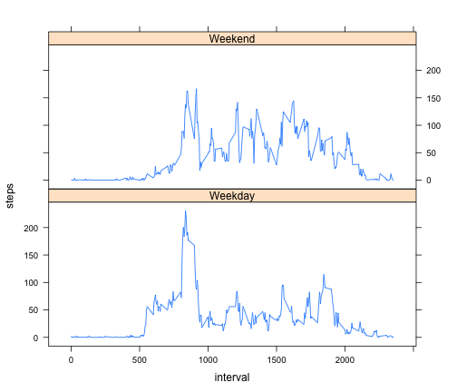

# Reproducible Research: Peer Assessment 1

## Loading and preprocessing the data

```r
library(lubridate)
library(lattice)

if (!file.exists("activity.zip")) {
  download.file(url = "https://d396qusza40orc.cloudfront.net/repdata%2Fdata%2Factivity.zip",
                destfile = "activity.zip",
                method = "curl")
  }

if (!file.exists("activity.csv")) {
  unzip ("activity.zip")
  }

activity <- read.csv("activity.csv")

activity[, "clean_date"] <- as.Date(strptime(activity[, "date"], format='%Y-%m-%d'))

timestamp <- strptime(sprintf("%s %04d",
                              activity[,"date"],
                              activity[,"interval"]),
                              format="%Y-%m-%d %H%M")
time <- strftime(timestamp, format="%H:%M")
dayOfWeek <- weekdays(timestamp)
activity <- cbind(activity, timestamp, time, dayOfWeek)

stepsByDay <- aggregate(activity$steps, by=list(activity$date), FUN=sum, na.rm=TRUE)
names(stepsByDay) <- c("date", "steps")

stepsByInterval = aggregate(activity$steps, by=list(activity$interval), FUN=mean, na.rm=TRUE)
names(stepsByInterval) <- c("interval", "steps")

stepsByTime = aggregate(activity$steps, by=list(activity$time), FUN=mean, na.rm=TRUE)
names(stepsByTime) <- c("timestamp", "steps")
```

## What is mean total number of steps taken per day?

```r
hist(stepsByDay$steps,
     breaks = 20,
     main = "Histogram of total steps taken per day",
     xlab = "Total Steps")
```

 


```r
totalStepsMean <- round(mean(stepsByDay$steps, na.rm=TRUE))
totalStepsMedian <- median(stepsByDay$steps, na.rm=TRUE)
```

The mean number of steps taken per day is 9354.
The median number of steps taken per day is 10395.


## What is the average daily activity pattern?

```r
plot(stepsByTime$timestamp,
     stepsByTime$steps,
     type="l",
     main="Daily Activity Pattern",
     xlab = "Time",
     ylab = "Steps")
```

 


```r
maxStepRow <- activity[which(activity[, 1] == max(activity$steps, na.rm = TRUE)), ]
```

The maximum number of steps in a 5 minute interval was taken on 2012-11-27 during the interval starting at 06:15


## Imputing missing values


```r
naCount <- sum(is.na(activity$steps))
```

There are 2304 missing step values in the data set.


```r
row.names(stepsByInterval) = stepsByInterval$interval

activityExtrapolated <- activity

for (i in 1:nrow(activityExtrapolated)) {
  if (is.na(activityExtrapolated[i,"steps"])) {
    interval <- toString(activityExtrapolated[i, "interval"])
    activityExtrapolated[i,"steps"] <- stepsByInterval[interval, "steps"]
  }
}

stepsByDayExtrapolated <- aggregate(activityExtrapolated$steps,
                               by=list(activityExtrapolated$date),
                               FUN=sum)
names(stepsByDayExtrapolated) <- c("date", "steps")
```

```r
hist(stepsByDayExtrapolated$steps,
     breaks = 20,
     main = "Histogram of total steps taken per day",
     xlab = "Total Steps")
```

 


```r
totalStepsExtrapolatedMean <- round(mean(stepsByDayExtrapolated$steps))
totalStepsExtrapolatedMedian <- median(stepsByDayExtrapolated$steps)
```

The mean number of steps taken per day is 1.0766 &times; 10<sup>4</sup>.
The median number of steps taken per day is 1.0766 &times; 10<sup>4</sup>.

These values are higher than the estimates in the first part. Adding in the missing data increased the overal mean and median.

## Are there differences in activity patterns between weekdays and weekends?

```r
activityExtrapolated[,"day_factor"] <- ifelse(activityExtrapolated$dayOfWeek == "Saturday" |
                                  activityExtrapolated$dayOfWeek == "Sunday",
                                  "Weekend", "Weekday")

weekdays <- activityExtrapolated[which(activityExtrapolated$day_factor == "Weekday"),]
weekends <- activityExtrapolated[which(activityExtrapolated$day_factor == "Weekend"),]


byDayType <- aggregate(activityExtrapolated$steps,
                       by=list(activityExtrapolated$interval,
                               activityExtrapolated$day_factor),
                       FUN=mean)
names(byDayType) <- c("interval", "dayType", "steps")
```


```r
xyplot(steps ~ interval | dayType, data = byDayType, type = "l", layout=c(1,2))
```

 
